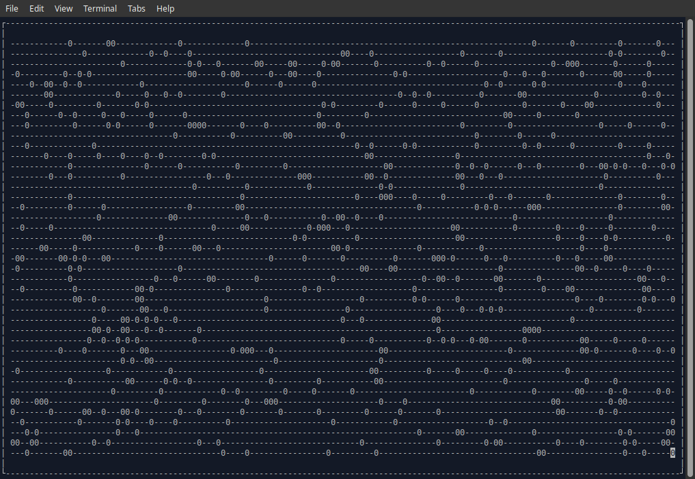

## GoGol Channels

So back in https://github.com/ninjapanzer/gogol I had some fun building a renderer and some groundwork for creating a kafka gol but I figured it might be nice to try it with channels to learn go channels as a method of pipe based communication

### Deep Dive
I am somewhat obsessed with cellular automata and Conway's Game of Life as a "hello world" for learning complex language features.

The overall goal here is to produce a simulation with autonomous cells performing all operations concurrently but without using mutex locks and waitgroups. The entire structure communicates with channels including the cells and the renderer.

#### Renderer Interface
The render is responsible for defining a window and exposing access to draw, clear, and refresh the display.

The built-in renders are a Shell and a Mock.

__Shell__ is built on the goncurses wrapper
__Mock__ Doesn't render anything but does create logging to trace events

#### World Interface

The __World__ is synonymous with the game board and should provide access to a matrix of elements to render Life (Cells).

This is a generic interface that can be implemented for any Cell concretion that implements Life

#### Life Interface

The goal of __Life__ is to provide a uniform way to collect the state of a cell. There might be multiple ways to compute state and the lifecycle of that action is up to the specific implementation we will often render a whole or part of a __World__.

### Channels Usage
For the point of this exploration of using a back channel between cells to compute state.

The traditional GoL solution is to iterate over the world and compute liveness on each draw phase.

For this implementation each cell is born aware of its neighbors and listens to their broadcast channels.

When a cell is created it assumes a bidirectional channel and exposes that publicly as a recieve only channel. 
As cells are formed they collect their neighbors channels and initialization state. Once all cells have been initialized they begin listening to each other.

#### State Computation
Because at the beginning of the simulation all the events have been populated and there are no changes we have to track both change state and current state of neighbors.

We keep this as a binary stream of 1s and 0s as they are accumulated. One of the tricks is the binary community state is the same order we listen to events from neighbor channels.
Each cell heartbeat which is 100ms we find the most recent state from all neighbors and XOR that against the last snapshot state. This defines the new cellular state of life.

If a cell is not broadcasting we mark it as unchanged to ensure our state binary streams match in length.

It is possible for multiple cell updates to happen between each cell's heartbeat and this creates some dissonance. The draw loop is also 100ms but each heartbeat and the renderer tick will always be off cycle.
This means we don't have smooth animcation. This is only because we are using a traditional rendering of the whole map instead of reacting to cellular changes and compositing the updates.

#### Future work
Compositing updates by rendering reactively to cellular state changes. This will also happen across a channel os each cell on screen can be rendered by itself.
This will require a cell to become aware of its render position to avoid creating a double buffer for collecting the cell state with a mutex.

### Usage

#### Dependencies
This project requires the following dependencies:
- Go 1.24 or later
- ncurses development headers (for the Shell renderer)
- pkg-config (recommended for finding ncurses)
- X11 development headers (for the Ebiten renderer)
- OpenGL development headers (for the Ebiten renderer)

If you're using Nix, the dependencies are automatically managed through the flake.nix file.

For other systems, you'll need to install the following packages:

For ncurses (required for the Shell renderer):
- Debian/Ubuntu: `apt-get install libncurses-dev pkg-config`
- Fedora/RHEL: `dnf install ncurses-devel pkgconfig`
- macOS: `brew install ncurses pkg-config`

For X11 and OpenGL (required for the Ebiten renderer on Linux):
- Debian/Ubuntu: `apt-get install libx11-dev libxrandr-dev libxinerama-dev libxcursor-dev libxi-dev libxxf86vm-dev libgl1-mesa-dev libglu1-mesa-dev`
- Fedora/RHEL: `dnf install libX11-devel libXrandr-devel libXinerama-devel libXcursor-devel libXi-devel libXxf86vm-devel mesa-libGL-devel mesa-libGLU-devel`
- macOS: `brew install glfw3` (Ebiten uses different backends on macOS, but may still need some OpenGL libraries)

##### Troubleshooting Build Issues
If you encounter errors about missing header files even after installing the required packages:

1. Ensure CGO is enabled: `export CGO_ENABLED=1`
2. If using a version manager like asdf, you might need to specify include paths:
   ```
   export CGO_CFLAGS="-I/usr/include -I/usr/include/X11 -I/usr/include/GL"
   export CGO_LDFLAGS="-L/usr/lib -lncurses -lX11 -lXrandr -lXinerama -lXcursor -lXi -lXxf86vm -lGL -lGLU"
   ```
3. Or use pkg-config (recommended):
   ```
   export CGO_CFLAGS="`pkg-config --cflags ncurses x11 xrandr xinerama xcursor xi gl glu xf86vm`"
   export CGO_LDFLAGS="`pkg-config --libs ncurses x11 xrandr xinerama xcursor xi gl glu xf86vm`"
   ```

For specific errors:
- Missing `curses.h`: Install libncurses-dev
- Missing `X11/Xlib.h`: Install libx11-dev
- Missing `GL/glx.h`: Install libgl1-mesa-dev
- Cannot find `-lXxf86vm`: Install libxxf86vm-dev (Debian/Ubuntu) or libXxf86vm-devel (Fedora/RHEL)

##### Resolving Conflicts Between Nix and asdf
If you're using Nix for system dependencies and asdf for Go version management, you might encounter conflicts. This happens because Nix provides its own environment, while asdf manages Go separately. To resolve this:

1. Update the Makefile to explicitly use the Go installation from asdf:
   ```
   # Replace 'go' with the full path to the asdf-managed Go binary
   ${HOME}/.asdf/installs/golang/<version>/go/bin/go
   ```

2. Set the GOPATH environment variable to point to the asdf packages directory:
   ```
   GOPATH=${HOME}/.asdf/installs/golang/<version>/packages
   ```

3. Ensure the go.mod file specifies a Go version compatible with your asdf-managed Go:
   ```
   go 1.24  # If using Go 1.24.x from asdf
   ```

4. For CGO builds, include all necessary library flags:
   ```
   CGO_CFLAGS="`pkg-config --cflags ncurses x11 xrandr xinerama xcursor xi gl glu xf86vm`"
   CGO_LDFLAGS="`pkg-config --libs ncurses x11 xrandr xinerama xcursor xi gl glu xf86vm`"
   ```

#### Running
To run with the ncurses renderer: `make run-ncurses`

To run with the Ebiten renderer: `make run-ebiten`

To build: `make build`

### Screenshot

